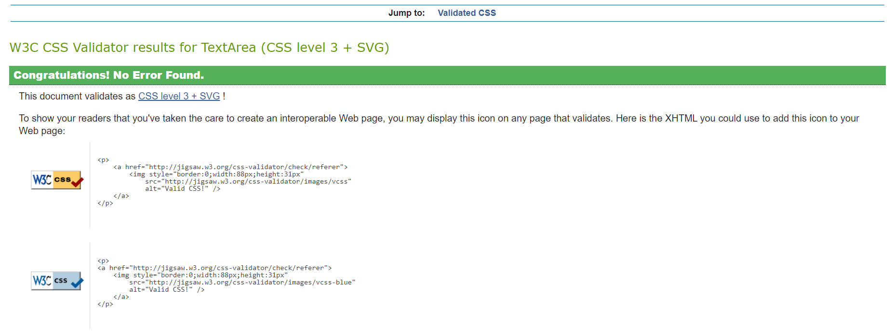
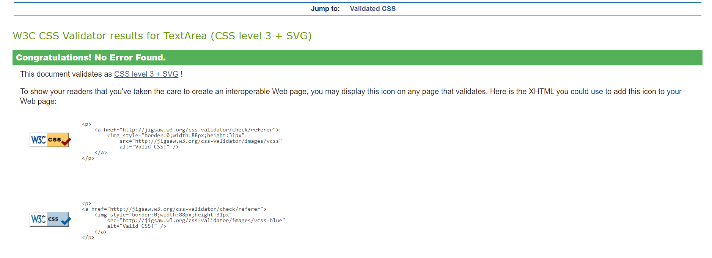
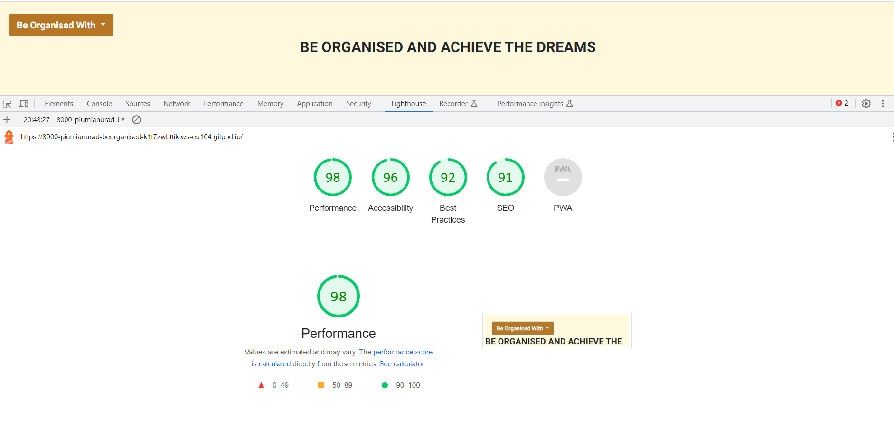

# BE ORGANISED AND ACHIEVE THE DREAMS

"Be organised and achieve the dreams" application is designed to be responsive that allow visitors to view on a range of devices. And also it helps the visitors to be organised in their day today work and to reach the dreams.

**********************

[View BE ORGANISED AND ACHIEVE THE DREAMS as an application on web.](https://piumianuradha.github.io/Be-Organised/)

## CONTENTS
* User Experience (UX)
     * Initial Discussion
     * User stories

* Design
     * Color Scheme
     * Typography
     * Imagery
     * Wire Frames
     * Features
     * Accessibility

* Technologies Used
     * Languages
     * Frameworks and Programs 

* Deployment  

* Testing
     * W3C Validator
     * Solved Bugs
     * Testing User Stories
     * Lighthouse
        * Index page
        * TodoList page
        * Timer page
     

* Credits
     * Acknowledgement

## USER EXPERIENCE

### First Time Visitor Goals
1. To get an idea how to achieve each task with an allocated time.
2. To get an idea how to organise your day to day tasks.
3. To be able to view the application on a range of device sizes.

### Frequent Visitor Goals

1. To be able to use the application as habbit in day today life.
2. To be able to organise your life in order to achieve the dream goals.

## DESIGN

### Color scheme

The web application uses a palette of colours that are used in BE ORGANISED AND ACHIEVE THE DREAMS logo, images, buttons and menues. The colour palette was created using the Coolors website.

## TYPOGRAPHY
"Roboto" font in Google Fonts was used for the whole web application.

## IMAGERY

All the images were created using the Snipping tool software.

## WIREFRAMES

Wireframes were created for mobile, tablet and desktop.

### Home Page Wireframe

**********************

### Todolist to be prepared Wireframe

**********************
### Todolist to be prepared Wireframe with alert box

**********************

### Timer Wireframe

**********************

## FEATURES

This web application has three pages.Two of the pages are accessible from the dropdown menu (TodoList to be prepared, The timer to be stay focused).

* Be Organised Page

This page has a drop down menu that navigates to other two pages that are Todilist to be prepared page and The Timer to Stay Focused.

* TodoList to be prepared page
The page has a drop down menu that navigates to other two pages that are Be Organied page and The Timer to Stay Focused.

*The Timer to Stay Focused
This page has a drop down menu that navigates to other two pages that are Be Organised page and TodoList to be prepared page. 
  

## ACCESSIBILITY

This application has been carefully desined in order to be accessible friendly as posible. Accessibility has been achieved by,
* Using semantic HTML
* Ensuring that the colour contrast is sufficient enough through out the web application.

## TECHNOLOGIES USED
* Languages Used
     * HTML,CSS and JavaScript were ued to create this web application.
     * Frameworks and Programs used
     * Balsamiq was used to create wireframes.
     * Git was used for version control.
     * Github was used to save and store the files for the application.
     * Google Fonts are used to import the fonts used on the web application.
     * Google Dev Tools were used to troubleshoot and test features, solve issues with regard to the responsiveness and styling.
     * Am I responsive? has been used to ensure the web application is responsive for all the devices.

## DEPLOYMENT AND LOCAL DEVELOPMENT

### Deployment
Github pages has been used to deploy the live website. 

The instructions are a follows:

1. Log in to Github
2. Find the reporsitory for the particular project, BE ORGANISED AND ACHIEVE THE DREAMS.
3. Click on the Settings link
4. Click on the pages link in the left hand side navigation bar.
5. In the Source section, choose main from the dropdown, select the branch menu. Select Root from the drop down select folder menu.
6. Click Save. Your live Github pages site is now deployed at the URL down.

## TESTING
### Principles of Automated Testing
In javascript, automated testings are performed with the use of software tools and frameworks to write and execute tests the code automatically. The main purpose of using the automated testing is to ensure that the code you write in the Javascript, functions correctly, maintains its integrity and to be able to work as expected as you make changes and updates to your codebase.

There are many types of testing in Javascript.
1. Unit Testing
The unit testing refers to testing individual units or functions of the Javascript code in isolation. You write test cases that check whether the particular function or component produces the output according to the given set of input. Some of the popular testing frameworks for Javascript for unit testing are Jasmine, Mocha, and Jest.

2. Integration Testing
Intigration testing involves in focusing on testing the interactions between different components or modules of your application. This testing ensures that these components work together as expected. Examples of tools of integration testing are Jest, Cypress and Selenium.

3. End-to-End (E2E) Testing
E2E testing replicate the user interations with your application to ensure that it functions correctly as a whole. E2E testing often involves automating interactions with a web browser or a mobile application. Some of the popular types of E2E testings are Cypress, Puppeteer and WebDriver.io.

4. Functional Testing
Functional testing involves to verify that your application's features and functionalities work as expected. This mainly involves testing user interfaces, user flows, and user interactions. Examples of frameworks for functional testings are Testcafe and Playwrite.

5. Snapshot Testing
This testing involves in capturing the current state of the component or output and compares it to a previously saved "snapshot". Mostely this testing type is used to test the UI components to ensure that they do not unintentionally change their appearance or behaviour. Commonly used snapshot testing is Jest.

6. Performance Testing 
This type of testing involves on evaluating the performance characteristics of Javascript  code or application. Lighthouse and WebPageTest are some of the examples that can help assess factors such as page load times, resourse usage or overall performance.

### The benefits of Automated testing
* Faster Feedback
* Regression Testing (Unintended side effects)
* Increased confidence (Less likely to introduce bugs)
* Documentation (Test cases can be used as documentation for how different parts of the code should behave)

### Principles of Manual Testing

Manual Testing involve the process of testing software manually without using automated testing tools or scripts. Manual testing is done by a human tester who interacts with the application or code to identify or verify issues such as bugs, userbility problems and other issues that can effect the software's functionality or user experience.

### Some steps and techniques of manual testing

* Understanding the Requirements (The clear understanding of the requirements and expectations for the software before testing)

* Test Planning

* Test Execution (Run the code using a web browser, comand-line interface, or any other environment.)

* Positive and negative Testing (Positive testing is the functioning of the application as expected and negative testing involves checking how the application handles error and exceptions)

* Userbility Testing (Assessing the user interface for usability, consistancy and intuitiveness. And verify that the design follows best practices and that it is user-friendly)

### Testing in this application

Considering the automation and manual testing, in this application manual testings have been performed. And also other reasons for performing manual testings are, 
* Human observation can be used in this application which can be useful to offer user-friendly system.
* Automation tests can be time consuming when testing small changes in the codes. 

### W3C Validator
W3C Validator has been used to validate all three HTML pages and CSS pages.
The screen shots are as follows:

### HTML W3C Validator for index, stopwatch and todolist pages

*********

*********

********

### CSS W3C Validator for index.css, stopwatch and for the todo list page

********

**********

***********

### JSHint for Javascript

*********

## TESTING USER STORIES

The following screenshot shows the first time visitor goals and these goals have been achieved below.
 *****************

**********************

### First time visitor
1. This application has a very easy allocation of the task that needs to be achieved and the time allocation is very straight forward that can be set easily and clearly.

2. In this application's user-friendly task allocations give the user an idea that how to organise your day to day tasks

3. Being able to view this application and use this application in a range of device sizes make our lives easier.

### Returning Visitor
* This application is very helpful when organising daily routines and working according to a stopwatch.

## LIGHTHOUSE
Chrome developer, Lighthouse has been used to test the performance, accesibility, the best practices and SEO of the web application.

Lighthouse
I used Lighthouse within the Chrome Developer Tools to allow me to test the performance, accessibility, best practices and SEO of the website.
**************

***********

## CREDIT
### Acknowledgement
I would like to take this as an opportunity to acknowledge the following people who helped me along the way in completing my second milestone project:
1. Ms Rachel Furlong -  the tutor, for her help in completing my project.
2. Mr Ben Kavanagh - the mentor, for his help in the second miestone project

And also I used ChatGPT to learn and get assistance for this application in many occasions.